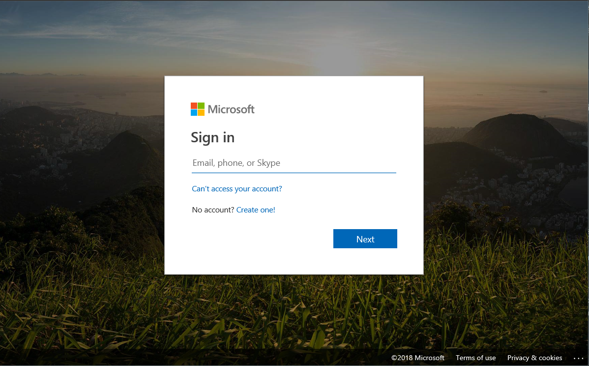
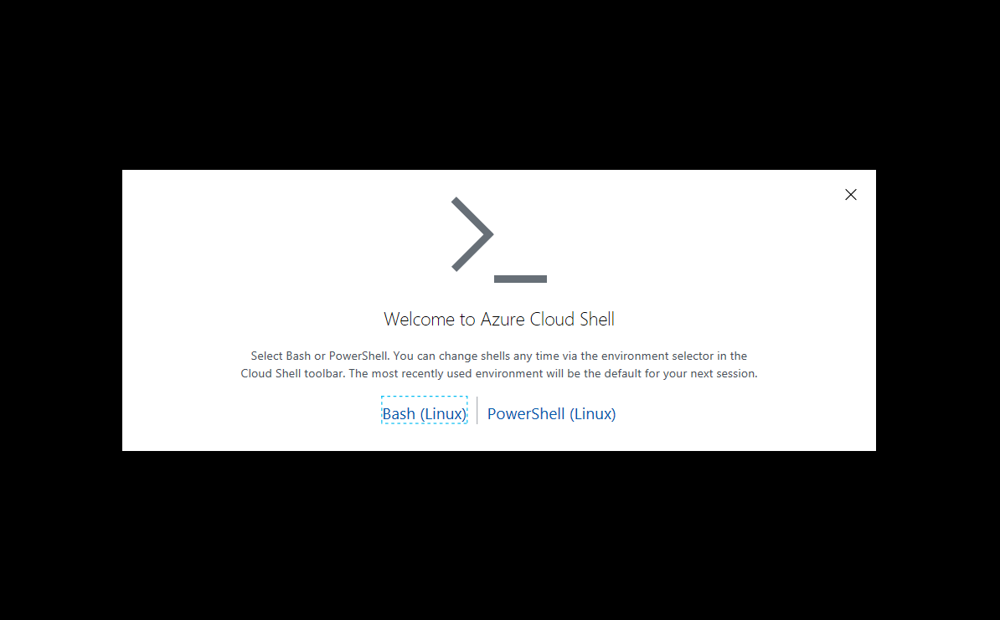
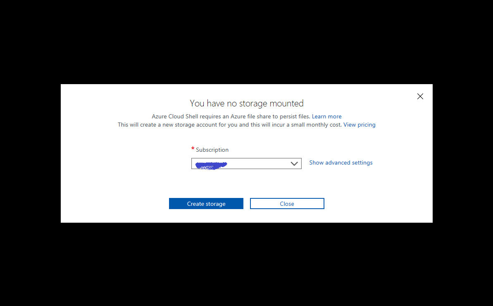
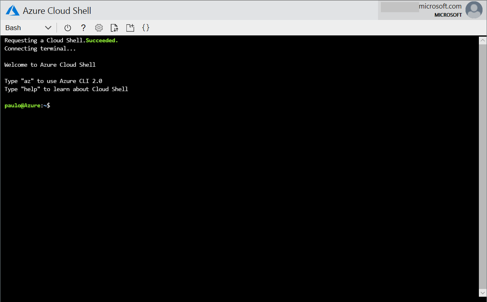

# storagespaces-single-node-template

This template is a very simple template that deploys a Windows VM and configures Storage Spaces in Stand Alone mode.

It assumes you already have a resource group with a Virtual Network deployed and that you have remote access from a jumpbox or through the network via VPN or Express Route since we are not deploying public ip address for this VM.

This is for testing purposes, depending on your workload Storage Spaces Direct is a better option. For more information about Storage Spaces please refer to:

[Storage Spaces overview](https://docs.microsoft.com/en-us/windows-server/storage/storage-spaces/overview)

[Storage Spaces Direct overview](https://docs.microsoft.com/en-us/windows-server/storage/storage-spaces/storage-spaces-direct-overview)

## Deployment

### Requirements

#### Services already deployed in an Azure Subscription
1. Azure Key Vault with the following items 
    
    **Secrets**
      *  adminPassword - the password value to be used as local administrator password
1. Existing virtual network
2. Connectivity to the virtual network to be able to access deployed VM through a jumpbox or VPN/ER
 
### How to deploy
#### Sign in to Cloudshell
1. Open your browser and go to <a href="https://shell.azure.com" target="_new">https://shell.azure.com</a>

2. Sign on with `Microsoft Account` or `Work or School Account` associated with your Azure subscription

    


3. If you have access to more than one Azure Active Directory tenant, Select the Azure directory that is associated with your Azure subscription
    
    

4. If this is the first time you accessed the Cloud Shell, `Select` "Bash (Linux)" when asked which shell to use.

    

    > Note: If this is not the first time and it is the "Powershell" shell that starts, please click in the dropdown box that shows "PowerShell" and select "Bash" instead.

5. If you have at least contributor rights at subscription level, please select which subscription you would like the initialization process to create a storage account and click "Create storage" button.
    

6. You should see a command prompt like this one:
    

#### Cloning the source sample project and executing deployment script
1. Change folder to your clouddrive so any changes gets persisted in the storage account assigned to your cloudshell
   ```bash
   cd ~/clouddrive
   ```
1. Clone this repository with the following git command
   ```bash
   git clone https://github.com/paulomarquesc/storagespaces-standalone-template.git
   ```
1. Change folder to storagespaces-standalone-template
   ```bash
   cd storagespaces-standalone-template
   ```
1. Review and change the parameters file as needed before deploying (you can use "vi" or "code" inside Azure Cloudshell for this operation)
   *  azuredeploy.parameters.json

1. Execute the deployment script the template (make sure you change command line arguments)
    * azuredeploy.json
        ```bash
        ./Deploy-AzureResourceGroup.sh -g test-rg -l eastus -v mykeyvault
        ```

To know all script deployment options, please execute the script wihtout any parameter.

```
paulo@Azure:~/clouddrive/storagespaces-standalone-template$ ./Deploy-AzureResourceGroup.sh

No options were passed

Usage:
./Deploy-AzureResourceGroup.sh [OPTIONS]
    -g <RESOURCE_GROUP>                [Required]: Name of initial esource group for deployment. Creates or updates resource group.
    -l <REGION>                        [Required]: Location in which to create resources.
    -s <STORAGE_ACCT_NAME>             [Required]: Name of Storage Account. Creates or updates Storage Account.
    -v <KEY_VAULT_NAME>                [Required]: Azure Key Vault name administrator password is stored. Defaults to: sofs-KV
    -r <STORAGE_ACCT_RG_NAME>          Name of the resource group where the Storage Account exists, it will default to the Resource Group name pass in -g argument.
    -t <TEMPLATE_PATH>                 Path to template file (relative to execution location of this script). Default: azuredeploy.json
    -p <TEMPLATE_PARAM_PATH>           Path to template parameter file (relative to execution location of this script). Default: azuredeploy.parameters.json
    -a <KV_ADMIN_PASSWORD_SECRET_NAME> Azure Key Vault secret name that holds the local administrator password. Defaults to: adminPassword

Example:

    ./Deploy-AzureResourceGroup.sh -g testRg -l westus -v keyvaultName
```


#### Template parameters and descriptions

##### azuredeploy.parameters.json

* **_artifactsLocation:** Auto-generated container in staging storage account to receive post-build staging folder upload.
* **_artifactsLocationSasToken:** Auto-generated token to access _artifactsLocation.
* **location:** Location where the resources of this template will be deployed to. Default Value: `westus2`
* **adminUsername:** Name of admin account of the VMs, this name cannot be well know names, like root, admin, administrator, guest, etc. Default Value: `pmcadmin`
* **adminPassword:** Admin password.
* **vmName:** VM Name. Default Value: `FileServer`
* **vmSize:** VM Size. Default Value: `Standard_E32s_v3 `
* **dataDiskSizeGB:** Size of each attached datadisk. Default Value: `2048`
* **dataDiskCount:** Number of data disks. Default Value: `7`
* **vnetRg:** Existing Virtual Network Resource Group.
* **vnetName:** Existing Virtual Network Name.
* **subnetName:** Existing Subnet Name where Single Mode Storage Spaces Server will be attached.
* **storagePoolName:** Name of the storage pool to be created. Default Value: `StoragePool1`
* **VirtualDiskName:** Virtual Disk Name to be created. Default Value: `VirtualDisk1`
* **FolderName:** Name of a folder to be created within the volume that will be used as shared folder. Default Value: `data`
* **SharedFolderName:** Name of the shared folder. Default Value: `share`
* **FullAccess:** User or group that will have full access to the share. Default Value: `Everyone`